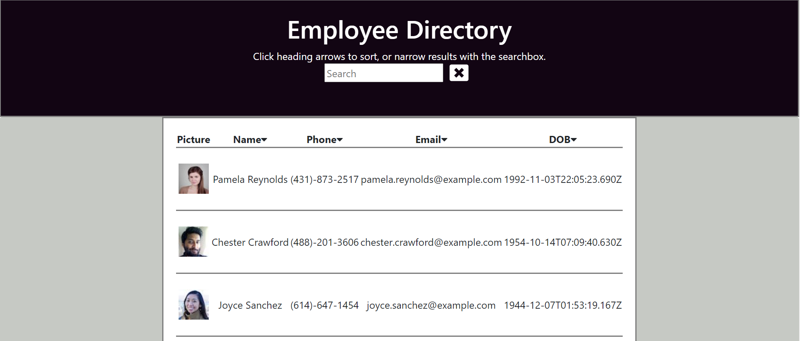

# Employee_Directory

## Description

This project was bootstrapped with [Create React App](https://github.com/facebook/create-react-app).

An employee directory built with React. The UI is broken into three main components; a search results container, a search form, and a results list. Each is sytled with its own custon css, as well as Bootstrap classes, and font awesome icons. The user is able to sort the table by name, email, or phone, as well as filter users by name via a search input form contained within the search form component.

Other techniques used include the map method, to render the list of random users, ternary operators in several of the sort methods, as well as the use of template literals to remove special characters from user phone numbers. The most challenging aspect was to 're-render' users once the list had been filtered via the search field. 

**[Manage Employees Here!]()**

## Table of Contents
* [Usage](#usage)
* [Credits](#credits)
* [License](#license)
* [Technologies](#Technologies)

## Usage
* **The Finished Product**  

## Technologies
* npm fontawesome
* npm bootstrap
* npm react
* npm axios
* node.js
* Random User API

## Credits
Here are a few resources that helped me get this project knocked out!
* [Random User Generator API](https://randomuser.me/)
* [HTML Tables](https://developer.mozilla.org/en-US/docs/Web/HTML/Element/tr)
* [Stackoverflow Template Literals](https://stackoverflow.com/questions/31048953/what-do-these-three-dots-in-react-do)
* [w3schools .sort() method](https://www.w3schools.com/jsref/jsref_sort.asp)
* [w3schools .parseInt() method](https://www.w3schools.com/jsref/jsref_parseInt.asp)
* [MDN Regular Expressions](https://developer.mozilla.org/en-US/docs/Web/JavaScript/Guide/Regular_Expressions)
* [Stackoverflow Regular Expressions](https://www.w3schools.com/jsref/jsref_parseInt.asp)
* [w3schools .trim() method](https://www.w3schools.com/jsref/jsref_trim_string.asp#:~:text=JavaScript%20String%20trim%20%28%29%20Method%201%20Definition%20and,4%20Parameters%205%20Technical%20Details%206%20More%20Examples)
* [Importing CSS Most Tutorial](https://programmingwithmosh.com/javascript/importing-css-files-in-react/)

## License
* Link for more information: (https://opensource.org/licenses/MIT)
* MIT License

      Copyright (c) [2021] [Richard A Seward]
      
      Permission is hereby granted, free of charge, to any person obtaining a copy
      of this software and associated documentation files (the "Software"), to deal
      in the Software without restriction, including without limitation the rights
      to use, copy, modify, merge, publish, distribute, sublicense, and/or sell
      copies of the Software, and to permit persons to whom the Software is
      furnished to do so, subject to the following conditions:
      
      The above copyright notice and this permission notice shall be included in all
      copies or substantial portions of the Software.
      
      THE SOFTWARE IS PROVIDED "AS IS", WITHOUT WARRANTY OF ANY KIND, EXPRESS OR
      IMPLIED, INCLUDING BUT NOT LIMITED TO THE WARRANTIES OF MERCHANTABILITY,
      FITNESS FOR A PARTICULAR PURPOSE AND NONINFRINGEMENT. IN NO EVENT SHALL THE
      AUTHORS OR COPYRIGHT HOLDERS BE LIABLE FOR ANY CLAIM, DAMAGES OR OTHER
      LIABILITY, WHETHER IN AN ACTION OF CONTRACT, TORT OR OTHERWISE, ARISING FROM,
      OUT OF OR IN CONNECTION WITH THE SOFTWARE OR THE USE OR OTHER DEALINGS IN THE
      SOFTWARE.

